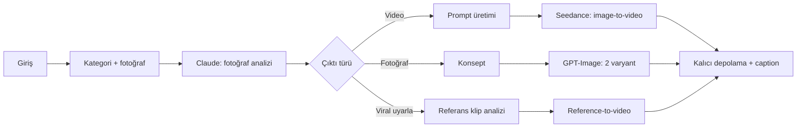

# Vidolya: ürün fotoğrafından reklam videosuna

**[vidolya.com](https://vidolya.com)** · Canlı SaaS · Next.js · TypeScript · Supabase · Claude · Seedance · GPT-Image

> Kaynak kod ticari olduğu için gizli. Bu sayfa ürünün neyi çözdüğünü, nasıl kurulduğunu ve hangi mühendislik kararlarının alındığını anlatıyor.

## Sorun

Restoran, kafe, kuyumcu ve butik gibi küçük işletmeler Instagram ve TikTok için düzenli dikey video üretmek zorunda. Ajans veya çekim pahalı ve yavaş, telefonla çekilen videolar ise profesyonel görünmüyor.

## Çözüm

İşletme ürününün fotoğrafını yükler, kategorisini seçer ve birkaç dakika içinde paylaşıma hazır bir dikey reklam videosu, profesyonel ürün fotoğrafı veya viral bir videonun kendi ürününe uyarlanmış halini alır. Açıklama metni de otomatik üretilir.

**Sonuç:** Platformda **370+ video** üretildi.

## Ürün akışı

## Uçtan uca neler yaptım?

- **Kimlik doğrulama ve müşteri paneli:** Supabase Auth, captcha korumalı kayıt, galeri ve üretim geçmişi.
- **AI üretim hattı:** Fotoğraf analizi, konsept ve prompt üretimi için Claude; video için Seedance; sahne görseli ve ürün fotoğrafı için GPT-Image.
- **Kredi sistemi:** Her işletmenin kredisi var; ücretli her üretim krediye bağlı.
- **Admin paneli:** Kullanıcı ve kredi yönetimi, takılan işlerin izlenmesi ve kurtarılması.
- **Arka plan işleri:** Yarım kalan video işlerini tamamlayan ve eski dosyaları temizleyen zamanlanmış görevler.

## Zor kısımlar ve kararlar

### 1. Kredi asla kaybolmamalı, asla iki kez harcanmamalı
Video üretimi dakikalarca süren, dış bir sağlayıcıda çalışan ve başarısız olabilen bir iş. Kredi, işe başlamadan önce veritabanında **atomik olarak rezerve ediliyor**. Sağlayıcı hata verirse veya iş zaman aşımına uğrarsa kredi aynı transaction içinde iade ediliyor. Başarılı işte iade yok.

### 2. Ücretli bir işi yanlışlıkla iki kez başlatmamak
Ağ zaman aşımında "tekrar dene" demek, sağlayıcıya iki kez para ödemek demek olabilir. Bu yüzden:
- Ücretli işi başlatan çağrılar yalnızca sağlayıcının açıkça "tekrar dene" dediği durumda yeniden deneniyor; belirsiz hatalarda ikinci iş açılmıyor.
- Her istek kendi kimliğiyle kaydediliyor; yanıt kaybolursa durum veritabanından uzlaştırılıyor.
- Video birleştirme gibi adımlar, eşzamanlı iki isteğin aynı işi yapmaması için veritabanında **claim** alınarak yürütülüyor.

### 3. Maliyetin kontrolden çıkmaması
Dakikalık rate limit tek başına günlük harcamayı sınırlamıyor. Bu yüzden ücretli uç noktalarda **dakikalık + günlük tavanlar**, sunucusuz instance'lar arasında paylaşılan veritabanı tabanlı sayaçla uygulanıyor. Seçilmeyen fotoğraf varyantları ve sahipsiz dosyalar otomatik temizleniyor.

### 4. Takılan işlerin kendi kendine toparlanması
Kullanıcı sekmeyi kapatsa bile iş kaybolmuyor. Arka plan görevi uzun süredir bekleyen işleri tespit ediyor; tamamlanmışsa sonucu kaydediyor, başarısızsa krediyi iade ediyor. Admin kurtarma işlemi de aynı atomik kurallarla çalışıyor.

## Kalite

- GitHub Actions'ta her PR'da test, lint, TypeScript kontrolü ve production build.
- Maliyet korumaları, kurtarma akışları ve operasyonel güvenlik için ayrı test dosyaları.
- Veritabanı değişiklikleri sıralı migration'larla, satır seviyesinde güvenlik (RLS) politikalarıyla yönetiliyor.

## Teknolojiler

Next.js (App Router) · React · TypeScript · Tailwind CSS · Supabase (Auth, Postgres, Storage, RLS, RPC) · Anthropic Claude · Seedance · GPT-Image · CloudConvert · Vercel Cron · GitHub Actions

---

<b>🇬🇧 English summary</b>

**Vidolya** is a live SaaS that turns a product photo into a vertical ad video, a professional product shot, or a remake of a viral clip, for restaurants, jewellers and boutiques. **370+ videos** have been generated on the platform.

I built it end to end: authentication, customer dashboard, the AI generation pipeline (Claude for analysis and prompts, Seedance for video, GPT-Image for images), a credit-based usage system and an admin panel.

Key engineering decisions:
- **Atomic credit reservation and refund** in the database, so credits are never lost or double-spent.
- **No duplicate paid jobs:** only explicit provider rejections are retried, requests carry their own IDs, and long-running steps take a database claim.
- **Cost guards:** per-minute and daily caps shared across serverless instances, plus automatic cleanup of unused media.
- **Self-healing jobs:** a scheduled worker finishes or refunds stalled jobs.

